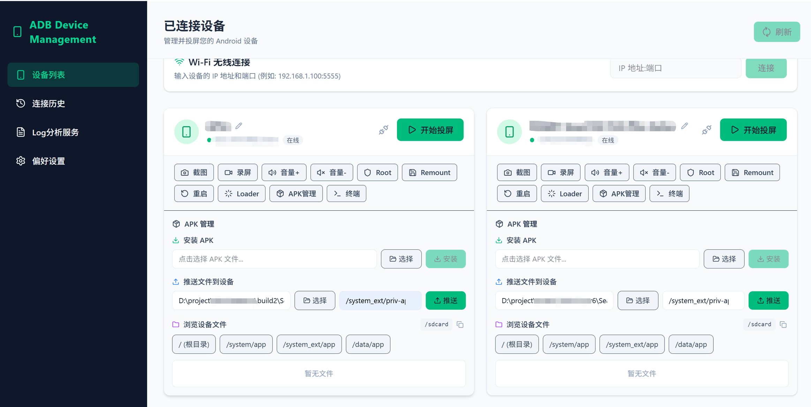
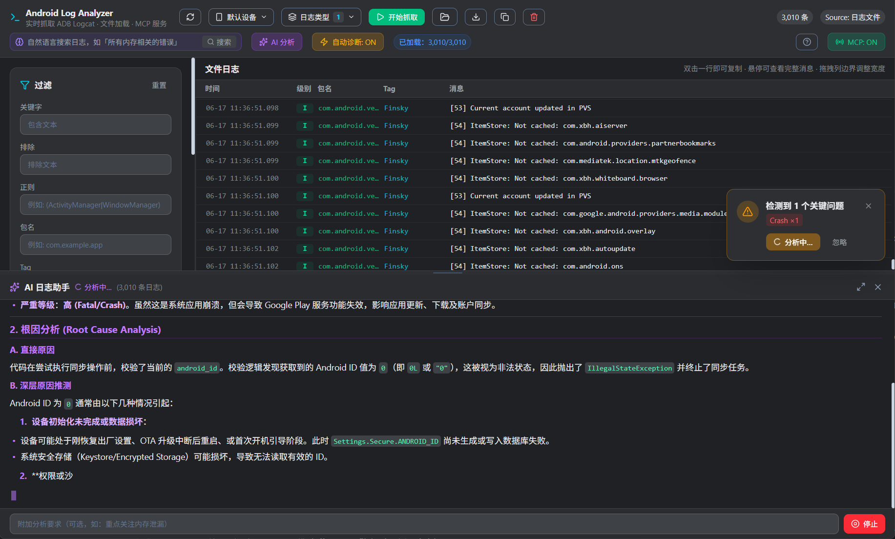
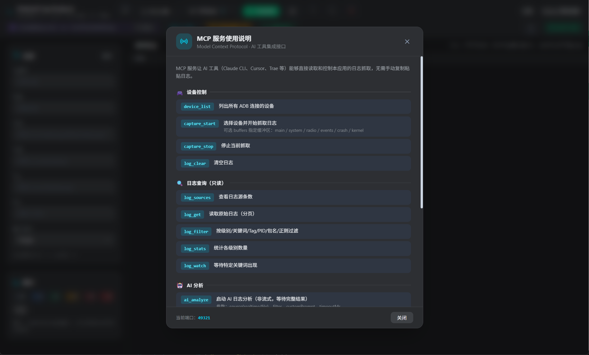
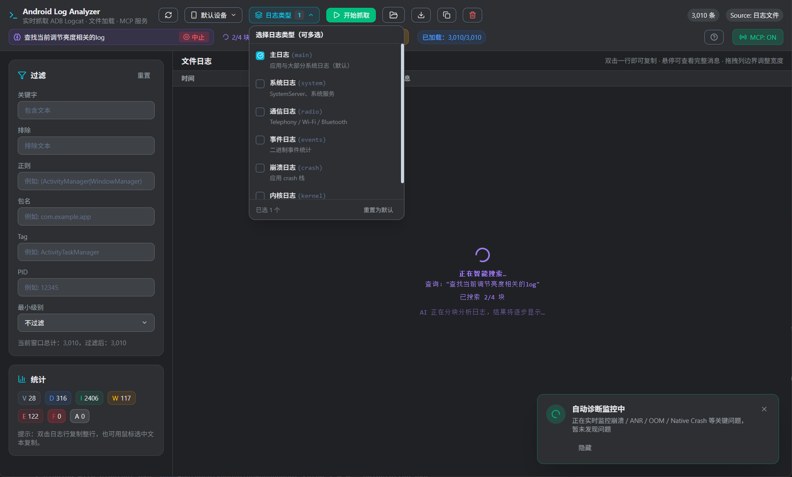

# AdbDeviceManagement

> 基于 Electron + React 19 + TailwindCSS 构建的跨平台 Android 设备全生命周期管理桌面应用，底层封装 `adb` 与 `scrcpy`，并集成 AI 智能日志分析与 MCP（Model Context Protocol）服务。



## 功能特点

### 1. 设备管理与控制
自动检测 USB / Wi-Fi 连接的 Android 设备，每个设备卡片提供开始投屏、截图、录屏、音量调节、Root 切换、Remount、重启、Loader、APK 管理、终端等快捷操作，将原本需要记忆大量参数的命令行操作简化为一次点击。

- 🚀 **设备管理**：自动检测通过 USB 或 Wi-Fi (ADB) 连接的 Android 设备
- 📱 **一键投屏**：快速启动 `scrcpy` 进行低延迟、高画质的屏幕镜像
- 🎮 **快捷控制**：
  - 📸 截取屏幕并保存到本地
  - 🎥 屏幕录制（支持保存到本地）
  - 🔊 调节音量 (+ / -)
  - ⏻ 模拟电源键控制息屏/亮屏
  - 🔓 Root 切换 / Remount / 重启 / Loader
  - 📦 APK 拖拽安装 / 批量管理
  - 💻 内置 ADB 终端

### 2. Log 分析服务
独立的日志分析窗口，支持实时 logcat 抓取（realtime / file 两种数据源）、本地 `.log` 文件加载、多维度过滤（关键字、排除、包名、Tag、PID、级别），以及导出 / 复制等能力。双击日志行即可复制，悬停查看完整消息。



- 📋 **多缓冲区抓取**：支持 main / system / radio / events / crash / kernel 多缓冲区选择
- 🔍 **智能搜索**：自然语言搜索 + 本地关键字匹配 + AI 语义扩展
- 🚨 **自动诊断**：自动识别 Crash / ANR / OOM 等异常，彩色标签分类展示
- 💾 **导入导出**：支持加载 `.log` 文件、导出过滤结果

### 3. AI 智能日志分析 + MCP 服务
- **AI 智能分析**：基于 `agnes-2.0-flash` 模型，以流式输出方式实时返回分析结果，支持 Markdown 渲染（标题、代码块、表格、列表等）、多轮对话追问、结果导出为 `.md` 文件。
- **MCP 服务**：开启后（默认 `http://127.0.0.1:3000/sse`），外部 AI 工具（Claude CLI、Cursor、Trae 等）可通过自然语言指令直接控制日志抓取与 AI 分析，提供 `device_list`、`capture_start`、`log_filter`、`ai_analyze` 等 11 个工具。




### 4. 其他特性
- 🎨 **现代化 UI**：基于 Tailwind CSS 打造的美观、流畅的用户界面，支持多主题切换（简约默认、可爱甜心、科技未来、清新海洋、自然森林、落日余晖）
- 🔄 **OTA 自动更新**：支持差分增量更新，无需重复下载完整安装包
- 📝 **连接历史**：自动保存无线连接历史，一键重连
- 🖥️ **终端全屏模式**：Ctrl+滚轮缩放字体，结构化输出排版

## 环境要求

在使用本软件前，请确保您的系统已安装以下依赖，并已将其添加至系统环境变量 (`PATH`)：
1. [Node.js](https://nodejs.org/)（用于编译和运行项目）
2. [ADB (Android Debug Bridge)](https://developer.android.com/studio/releases/platform-tools)
3. [scrcpy](https://github.com/Genymobile/scrcpy)

> Windows 用户建议直接下载 `scrcpy` 官方自带 adb 的 release 压缩包，并将其解压路径添加至系统环境变量。

## 安装与运行

### 方式一：下载安装包（推荐普通用户）
从 [GitHub Releases](https://github.com/xiandan001/scrcpy-gui/releases) 下载最新版安装包，双击安装即可使用。

### 方式二：源码运行（推荐开发者）
```bash
# 1. 安装依赖
npm install

# 2. 启动开发模式
npm run electron:dev

# 3. 构建打包（生产环境）
npm run electron:build
```

## 使用前准备

- 请确保 Android 设备已在开发者选项中开启 **USB 调试** 并在连接电脑时授权
- WiFi 调试需先通过 USB 连接设备，在设备卡片中点击"连接 WiFi"按钮即可一键切换无线调试
- 使用 AI 智能分析功能时，需保持网络畅通

## 技术栈

| 类别 | 技术 |
|------|------|
| 框架 | Electron + React 19 |
| 构建工具 | Vite + electron-builder |
| 样式 | TailwindCSS 4 |
| 核心依赖 | adb、scrcpy、electron-updater |
| AI 模型 | agnes-2.0-flash（流式输出） |
| 协议 | MCP（Model Context Protocol） |

## 项目结构

```
scrcpy-gui/
├── electron/                # Electron 主进程
│   ├── main.cjs             # 主进程入口（IPC、自动更新、MCP 服务）
│   └── preload.cjs          # 预加载脚本（IPC 桥接）
├── src/                     # 渲染进程
│   ├── App.jsx              # 主应用组件
│   ├── components/
│   │   └── LogAnalyzer.jsx  # 日志分析组件
│   └── shared/              # 共享工具（过滤、解析、日志类型）
├── scrcpy-win64/            # 内置 scrcpy + adb（Windows）
├── docs/                    # 文档与截图
└── electron-builder.json    # 打包配置
```

## License

MIT
